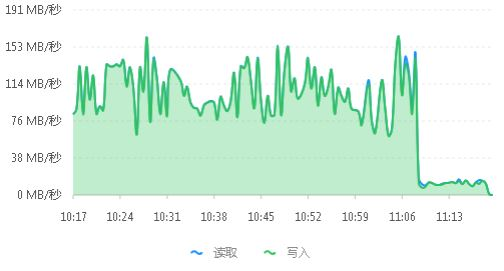

# s3fs并发测试容器

测试单bucket在s3fs的场景下，可以同时挂载多少个客户端，并同时往里复制数据

## 容器变量

|变量名|解释|
|-----|----|
|TEST_URL |并发开关，只有服务有效返回200时，任务才会执行，保证所有容器都启动后，再让此服务有效|
|BUCKET_NAME|桶的名称|
|ACCESS_KEY_ID|key|
|SECRET_ACCESS_KEY|安全key|
|S3_URL|s3url|
|TEST_FILE|复制的源文件路径，由于文件很大，在容器内不产生文件，使用数据卷或着映射的方式进容器内|

## 运行

### 本地手动运行

启动容器，请更换路径和IP地址，IP地址为docker0的IP

```shell
docker run -it -v /home/joelin/tm/s3fs:/data  \
      -e TEST_URL=http://172.17.0.1:8081/ \
      -e BUCKET_NAME=testbk     \
      -e ACCESS_KEY_ID=0555b35654ad1656d804   \
      -e SECRET_ACCESS_KEY=h7GhxuBLTrlhVUyxSPUKUV8r/2EI4ngqJxD7iBdBYLhwluN30JaT3Q==   \
      -e S3_URL=http://172.17.0.1:8000/ \
      -e TEST_FILE=/data/testfile \
      --privileged \
      s3fstest
```

开启web服务，让数据复制启动。

>python -m SimpleHTTPServer 8081

检查 s3对象桶里面是否有文件？

### 测试案例

#### 配置及运行
用容器模拟100个客户端挂载同一个bucket，并同时写入一个5G的文件(容器的根为10G大小)，查看写入的情况。

> dd if=/dev/zero of=testfile bs=1M count=5120

容器使用k8s调度，由于存储有限，源文件使用nfs卷方式共享进100个容器内，在nfs上dd一个5G的文件。

使用镜像创建100个实例出来。然后启动web服务，让复制启动。

k8s 配置关键片段如下

```yaml
apiVersion: extensions/v1beta1
kind: Deployment
...
spec:
  progressDeadlineSeconds: 600
  replicas: 100
  revisionHistoryLimit: 2
  template:
    spec:
      containers:
      - env:
        - name: TEST_URL
          value: http://172.21.14.28:8081/
        - name: BUCKET_NAME
          value: testbk
        - name: ACCESS_KEY_ID
          value: HUGYK42Q4JTPKDPFN88I
        - name: SECRET_ACCESS_KEY
          value: UMOttyvvbBf6YCYipkq9W6cTWARwKqVJLptkvBGv
        - name: S3_URL
          value: http://172.21.14.31:8000
        - name: TEST_FILE
          value: /data/testfile
        image: www.demo.com/s3/s3fstest:latest
        imagePullPolicy: Always
        name: c1
        resources:
          limits:
            cpu: 200m
            memory: 512Mi
          requests:
            cpu: 200m
            memory: 512Mi
        securityContext:
          privileged: true
        terminationMessagePath: /dev/termination-log
        terminationMessagePolicy: File
        volumeMounts:
        - mountPath: /data
          name: fuse-store
      dnsPolicy: ClusterFirst
      restartPolicy: Always
      schedulerName: default-scheduler
      securityContext: {}
      terminationGracePeriodSeconds: 30
      volumes:
      - name: fuse-store
        persistentVolumeClaim:
          claimName: fuse-vol
```

### 结果查看

查看k8s平台，确认容器是否全部在运行中,确认100个容器都在运行中。

```shell
[root@test ~]# kubectl get pod -n swt |grep s3test|wc -l
100
```

查看ceph的流量趋势，确认复制已完成。




使用命令行查看对象存储桶内，是否有复核预期数量的文件数。查看方式参考 [s3cmd](https://github.com/s3tools/s3cmd) 工具手册。确认已复制完成100个文件进桶内。

```shell
[root@test ~]# s3cmd ls  s3://testbk|grep 5368709120 |wc -l
100
```

## 注意事项

由于s3fs处理数据时会在本地磁盘写数据以提高性能，临时占用大量本地磁盘的容量，所以如果预期处理的数据量较大的情况下，应该使用参数控制s3fs本地磁盘的cache使用量。使用ensure_diskfree来设置空余磁盘数量控制cache的占用，单位为MB。如 `-o ensure_diskfree=10240`  保留10个GB的磁盘余量。


